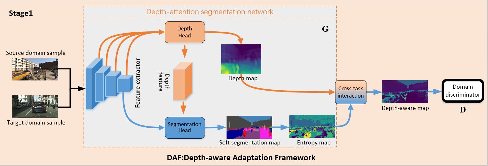
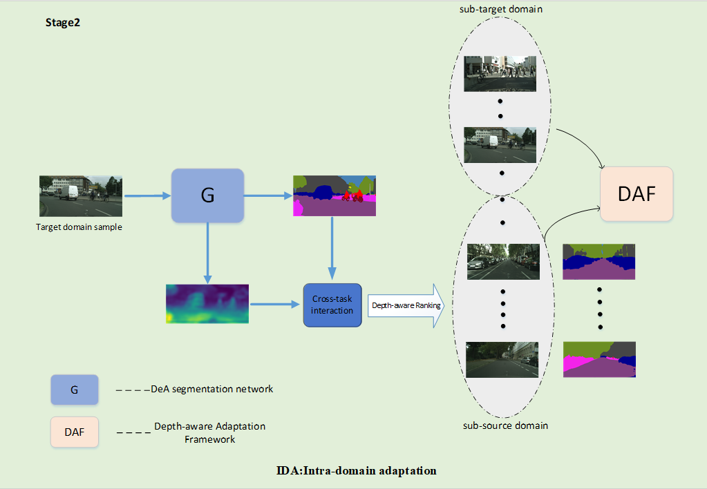

# Depth Guidance and Intra-Domain Adaptation for Semantic Segmentation

     


## Abstract 
Semantic segmentation has achieved impressive performance due to deep learning and labor-intensive, dense pixel-wise annotation. However, these models trained on source domain usually fail to generalize to a new target domain, especially when performing synthetic-to-real adaptation. Unsupervised Domain Adaptation (UDA) is proposed to address this issue. In this paper, we propose a Depth-aware Adaptation Framework (DAF) and a Intra-domain Adaptation (IDA) strategy in the context of UDA. Firstly, DAF is proposed to adapt domains by capitalizing on the inherent correlations of semantic and depth information. Specifically, a novel depth estimation network based on channel-wise attention mechanism is designed provide additional depth information. For fusing semantic and depth information, depth-aware maps are calculated by cross-task interaction, and then we align the distribution in depth-aware space between source and target domains. Secondly, we introduce IDA strategy to bridge the distribution gap among the subdomains (intra-domain gap). To this end, a depth-aware ranking strategy is presented to separate target domain into sub-source domain and sub-target domain, we perform the second alignment between sub-source domain and sub-target domain. Experiments on SYNTHIA→Cityscapes and SYNTHIA→Mapillary cross-domain tasks show that our method achieves the state-of-the-art results (46.7% mean IOU and 73.3% mean IOU, respectively).


## Our results
we conduct experiments on three popular synthetic-to-real UDA evaluation protocols(EPs). EP1: SYNTHIA→Cityscapes (16 classes),EP2: SYNTHIA→Cityscapes (7 classes), EP3:
SYNTHIA→Mapillary (7 classes). As shown in the following table:


some qualitative examples comparing the proposed method with CTRL and DADA.


## Create a virtual environment

- python>=3.7
- cuda>=10.0
- pytorch==1.7.1
- torchvision==0.8.1
- opencv

Install ADVENT:
```
git clone https://github.com/valeoai/ADVENT.git
pip install -e ./ADVENT
```

## Datasets

- **SYNTHIA**: Please follow the instructions [here](http://synthia-dataset.net/downloads/) to download the images. We used the _SYNTHIA-RAND-CITYSCAPES (CVPR16)_ split. Download the segmentation labels here [here](https://drive.google.com/file/d/1TA0FR-TRPibhztJI5-OFP4iBNaDDkQFa/view?usp=sharing). Please follow the dataset directory structure:
```
  SYNTHIA
  -RGB
  -Depth
  -parsed_LABELS

```
- **Cityscapes**: Please follow the instructions in [Cityscape](https://www.cityscapes-dataset.com/) to download the images and validation ground-truths. The Cityscapes dataset directory should have this basic structure:
```
Cityscapes
-camera
-gtFine
-disparity
-leftImg8bit
```

## Validation

download our pre-trained model in [onedrive](https://1drv.ms/u/s!AhZkFAnZvCoKzUc1gA9QubsETyOB?e=cWY2hR), and put it in `./pretrained`
```
python test_intra.py --cfg ./intra_trained.yml
```

## Train
please modify the  path in the configuration files

**step0:**
train DAF, the results in `experiments/snapshots`
```
python train.py --cfg ./configs/configs/dg.yml 
```
test DAF, find best model
```
python test.py --cfg ./configs/configs/dg.yml
``` 
**step1:**
training with ISL
```
python train_isl.py --exp_root_dir='your experiment root directory' --data_root='your data root directory'
```

**step2:**
divide target domain into two subdomain, and generate  pseudo label in `color_masks`
```
python entropy.py --normalize False --lambda1 0.66
```
train IDA, the model in `experiments/intra`
```
python train_intra.py --cfg ./intrada.yml
```
Last, test DAF+IDA
```
python test_intra.py --cfg ./intrada.yml
```
# Acknowledgements
This codebase depends on [AdvEnt](https://github.com/valeoai/ADVENT), [CTRL](https://github.com/susaha/ctrl-uda), and[IntraDA](https://github.com/feipan664/IntraDA),
Thank you for the work you've done!

# License
 DG is released under the [Apache-LICENSE-2.0](https://www.apache.org/licenses/LICENSE-2.0).
